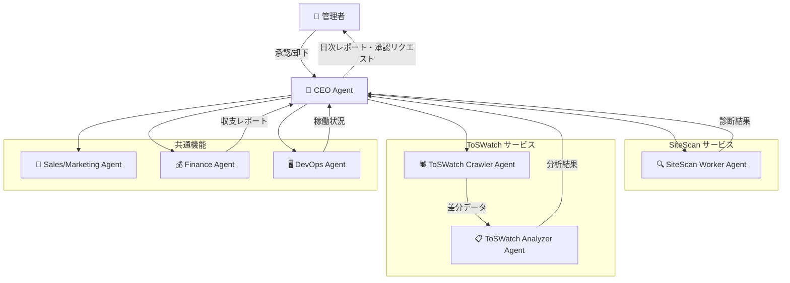
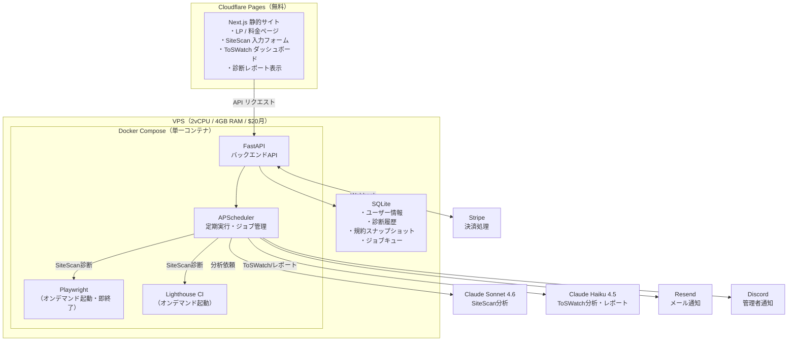
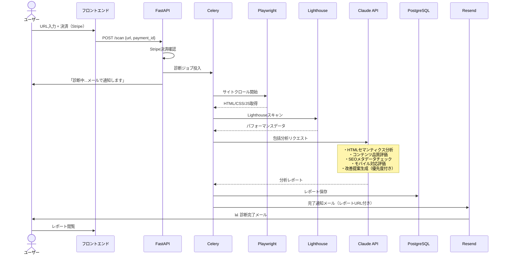
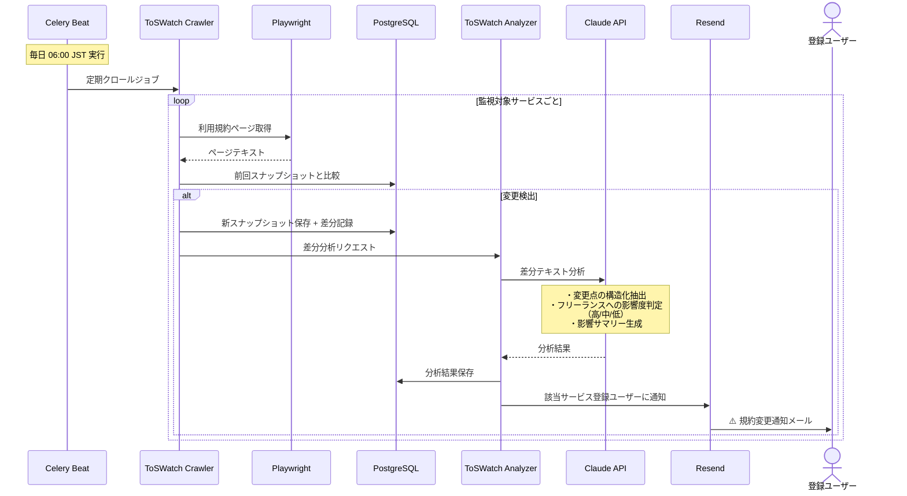
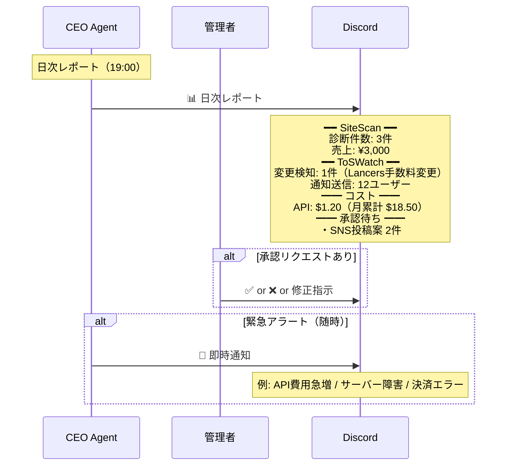

# Claude Agents による自律型オンライン会社経営 — 構想設計ドキュメント v3.1

> **目的**: Claude APIマルチエージェントチームが自律的に稼働するオンライン事業の全体設計  
> **前提**: 管理者は本業あり・副業として監督する立場。日常オペレーションはClaude判断で自動実行  
> **制約**: VPS $20/月程度、Claude API $50/月以内、マイナス収支を回避  
> **事業方針**: コンテンツ販売（レッドオーシャン）を避け、「Claudeが作業を代行する」サービス型事業  
> **法的方針**: 法的助言・金融助言に該当しない、法的リスクの低い事業のみ

---

## 1. 事業概要

> **要約**: 2つの自動化Webサービスを1つのVPS上で同時運営。案Cで初期収益を獲得し、案Dでサブスク収益を積み上げる。

### サービス①：SiteScan — Webサイト自動診断＆改善レポート

| 項目 | 内容 |
|------|------|
| **概要** | URL入力のみ → Claudeがサイトをクロール＆分析 → SEO・UX・コンテンツ・表示速度の包括的改善レポートを自動生成 |
| **差別化** | PageSpeed Insightsは「数値」だけ。SiteScanは「具体的に何をどう直すべきか」を自然言語で、優先度付きで提示 |
| **ターゲット** | フリーランス、個人事業主、副業者（自分のサイト/LPを持っている人） |
| **収益モデル** | ¥1,000/回（単発診断）or ¥2,980/月（月5回まで＋月次定点観測） |
| **法的リスク** | 極低 — 技術的分析のみ。助言・保証なし |

### サービス②：ToSWatch — 利用規約変更モニター＆影響分析

| 項目 | 内容 |
|------|------|
| **概要** | フリーランスが依存するサービス（CrowdWorks、Lancers、freee、Stripe等）の利用規約を定期監視 → 変更検知時に「何が変わったか」「実務への影響」を自動通知 |
| **差別化** | 利用規約変更の通知は来ても長文で読まない。ToSWatchは「手数料が3%→5%に変更」「支払いサイクルが月2回→月1回に変更」等、フリーランスの収入に直結する変更だけを抽出 |
| **ターゲット** | クラウドソーシング利用者、個人事業主、副業者 |
| **収益モデル** | ¥490/月（5サービス監視）/ ¥980/月（15サービス監視＋過去変更履歴閲覧） |
| **法的リスク** | 極低 — 事実の変更点通知のみ。法的解釈・助言は行わない |

### 2サービス同時運営の戦略

```
SiteScan（単発高単価）  →  即座に収益化。1回¥1,000で利益率が高い
        ↕ 相互送客
ToSWatch（サブスク低単価） →  継続課金で安定収入。LTV（顧客生涯価値）が高い

SiteScanユーザー → 「規約変更でサイト修正が必要になることも。ToSWatchで監視しませんか？」
ToSWatchユーザー → 「規約変更への対応でサイト改修が必要？SiteScanで診断しませんか？」
```

---

## 2. 組織設計（エージェント定義）

> **要約**: 7エージェント構成。2サービスを横断して統括するCEOの下に、サービス別ワーカー＋共通インフラ担当。

### エージェント一覧

| 役職名 | 担当 | 主な業務 | 権限 |
|--------|------|---------|------|
| **CEO Agent** | 全体統括 | 戦略判断、リソース配分、管理者報告、承認リクエスト | 自律（重大判断は人間承認） |
| **SiteScan Worker Agent** | サイト診断実行 | URLクロール、データ収集、Lighthouse実行、Claude分析、レポート生成 | 自律実行 |
| **ToSWatch Crawler Agent** | 規約監視 | 対象サイトの利用規約ページを定期クロール、差分検出 | 自律実行 |
| **ToSWatch Analyzer Agent** | 規約分析 | 検出された差分をClaude分析、影響度判定、通知文生成 | 自律実行 |
| **Sales/Marketing Agent** | 集客・CRO | LP最適化案の策定、SEO対策、SNS投稿案の作成（管理者承認後に実行） | 自律（公開は人間承認） |
| **Finance Agent** | 経理 | Stripe売上トラッキング、API費用監視、収支レポート、予算アラート | 自律実行 |
| **DevOps Agent** | インフラ | サーバー監視、デプロイ、バックアップ、ヘルスチェック | 自律（構成変更は人間承認） |

### 意思決定権限マトリクス

| 判断カテゴリ | 自律実行 | 人間承認必須 |
|-------------|---------|-------------|
| サイト診断の実行・レポート生成 | ✅ | |
| 利用規約のクロール・差分検出 | ✅ | |
| 変更通知の送信（既存ユーザーへ） | ✅ | |
| サーバー再起動・自動復旧 | ✅ | |
| API費用の日次監視・アラート | ✅ | |
| 監視対象サービスの追加・削除 | | ✅ |
| 料金プランの変更 | | ✅ |
| SNS投稿・広告出稿 | | ✅ |
| Stripe設定の変更 | | ✅ |
| 月額予算超過時の継続判断 | | ✅ |
| 利用規約・プライバシーポリシーの更新 | | ✅ |
| 外部サービスの有料契約 | | ✅ |

### 指揮系統



---

## 3. システムアーキテクチャ

> **要約**: VPS 1台に軽量構成でデプロイ。Phase 1はSQLite + APSchedulerで最小リソース。スケール時にPostgreSQL/Redis移行。

### 技術スタック（Phase 1: 軽量構成）

| レイヤー | 技術 | 選定理由 |
|---------|------|---------|
| **フロントエンド** | Next.js（静的エクスポート） | Cloudflare Pagesで無料ホスト。SSGで高速 |
| **バックエンドAPI** | FastAPI (Python) | 非同期対応、軽量、Claude SDKと同一言語 |
| **エージェント基盤** | Anthropic Python SDK | Tool Use対応。エージェントは常駐せずジョブ起動式 |
| **DB** | **SQLite**（Phase 1） | メモリ消費ゼロ。Phase 2以降でPostgreSQLに移行可 |
| **タスクキュー** | **APScheduler + asyncio**（Phase 1） | Redis/Celery不要。RAM節約。Phase 2以降でRQ移行可 |
| **Webクロール** | Playwright | サイト診断用。JS描画対応。**使用後にブラウザ即終了でメモリ解放** |
| **SEO分析** | Lighthouse CI (Node.js) | パフォーマンス・アクセシビリティスコア |
| **差分検出** | difflib (Python標準) | 利用規約テキストの差分抽出 |
| **決済** | Stripe Checkout + Webhook | 単発・サブスク両対応 |
| **認証** | メールリンク認証（マジックリンク） | DB軽量、パスワード管理不要 |
| **メール通知** | Resend（無料枠: 100通/日） | ToSWatch通知 + 診断完了通知 |
| **管理者通知** | Discord Webhook | 日次レポート・承認リクエスト |
| **ホスティング** | Cloudflare Pages（フロント）+ VPS（バックエンド） | フロント無料 |
| **コンテナ** | Docker Compose | 全サービスを1コンテナ構成（Phase 1） |
| **スケジューラ** | APScheduler | ToSWatch定期クロール、日次レポート |

### Claudeモデル使い分け（コスト最適化）

| 用途 | モデル | 理由 | 推定コスト/回 |
|------|--------|------|-------------|
| **SiteScan分析** | Claude Sonnet 4.6 | 分析精度とコストのバランス最適 | ~$0.15〜$0.30 |
| **ToSWatch差分分析** | Claude Haiku 4.5 | 差分テキストは短い。高速・低コスト | ~$0.01〜$0.03 |
| **CEO日次レポート** | Claude Haiku 4.5 | 定型レポート生成。低コスト十分 | ~$0.02 |
| **戦略判断（週次）** | Claude Sonnet 4.6 | 精度が必要な判断のみSonnet | ~$0.10 |

**API費用見積もり（月間）:**
- SiteScan 30件 × $0.25 = $7.50
- ToSWatch 日次10サイト × 30日 × $0.02 = $6.00
- レポート・管理系 = $1.50
- **合計: 約$15/月**（予算$50に対して大幅余裕）

### システム構成図（Phase 1: 軽量版）



### VPSリソース見積もり（Phase 1）

| コンポーネント | 常駐メモリ | ピーク時 |
|--------------|-----------|---------|
| FastAPI | ~100MB | ~150MB |
| APScheduler | ~30MB | ~50MB |
| SQLite | ~10MB | ~30MB |
| Playwright（診断時のみ） | 0MB（停止時） | ~500MB（起動時） |
| Lighthouse（診断時のみ） | 0MB（停止時） | ~300MB（起動時） |
| OS + Docker | ~500MB | ~500MB |
| **合計** | **~640MB** | **~1,530MB** |

→ 4GB RAM に対して十分な余裕。同時診断2件までなら安全稼働。

### SiteScan 処理フロー



### ToSWatch 処理フロー



---

## 4. 業務フロー

> **要約**: SiteScanはオンデマンド（ユーザーリクエスト駆動）、ToSWatchは日次定期実行。エージェントは24時間自律稼働。

### 日次自律稼働サイクル

```
06:00  [ToSWatch Crawler]    全監視対象サイトの利用規約クロール開始
06:30  [ToSWatch Analyzer]   変更検出分の分析・影響度判定
07:00  [ToSWatch Analyzer]   変更通知メール送信（該当ユーザーのみ）

08:00  [Finance Agent]       Stripe売上データ取得・API費用集計
08:30  [Sales Agent]         前日のアクセスログ分析・LP改善案策定
09:00  [DevOps Agent]        ヘルスチェック・ディスク使用量確認

      --- 日中はオンデマンド処理 ---
随時   [SiteScan Worker]      ユーザーからの診断リクエストを処理（平均15〜20分/件）
随時   [DevOps Agent]         サーバー監視・異常検知

19:00  [CEO Agent]            日次レポート生成
19:15  [CEO Agent]            Discord通知送信
                              内容:
                              ・本日の診断件数 / 売上
                              ・ToSWatch変更検知数
                              ・API費用（本日 / 月累計）
                              ・承認待ちタスク
                              ・異常・エラー報告

22:00  [DevOps Agent]         日次バックアップ（DB + 規約スナップショット）
```

### 週次サイクル

```
毎週月曜:
  [CEO Agent]      週次サマリー（売上推移・ユーザー増減・主要KPI）
  [Sales Agent]    週次マーケティングレポート（流入経路分析）
  [Finance Agent]  週次収支レポート

毎週金曜:
  [Sales Agent]    来週のLP改善案・SNS投稿案 → 管理者承認リクエスト
```

### 管理者への報告・承認フロー



### 異常時のエスカレーション

| レベル | 内容例 | 対応 |
|--------|--------|------|
| **L1（自動復旧）** | API一時エラー、クロール失敗（1サイト） | 自動リトライ（最大3回）。ログ記録 |
| **L2（CEO判断）** | 診断処理の遅延、ToSWatch部分失敗 | CEO Agentが調整。日次レポートに記載 |
| **L3（管理者通知）** | API費用急増、Stripe障害、サーバー負荷超過 | 即時Discord通知。管理者指示待ち |
| **L4（全停止）** | 月間API予算到達、重大セキュリティ問題 | 全エージェント停止。新規受付停止 |

---

## 5. 集客戦略（営業工数ゼロ）

> **要約**: 管理者の営業作業ゼロを維持。フリーミアム（無料診断）で口コミ誘導 + SEOをClaudeが自律運用。

### 集客チャネル

| チャネル | 施策 | 担当 | 管理者の作業 |
|---------|------|------|-------------|
| **フリーミアム** | SiteScan無料診断（月3回まで/ユーザー）。結果の最後に有料版の案内 | 自動 | なし |
| **SEO** | LP + ブログ記事（「サイト診断 無料」「利用規約 変更通知」等）をClaude自律作成 | Sales Agent（管理者承認後に公開） | 週1回承認のみ |
| **SNS (X)** | 診断レポートの一部を匿名化してサンプル投稿。AI活用の知見共有 | Sales Agent（管理者承認後に投稿） | 週1回承認のみ |
| **口コミ** | 無料診断ユーザーに「結果をシェアで次回割引」の仕組み | 自動 | なし |
| **開発者コミュニティ** | Zenn/Qiitaに技術記事（サービスの裏側解説）を投稿 | Sales Agent（管理者承認） | 月1回承認 |

### フリーミアムモデル設計

```
無料プラン（集客用）          有料プラン（収益用）
─────────────────          ─────────────────
SiteScan: 月3回              SiteScan: ¥1,000/回 or ¥2,980/月
  → 簡易レポート（スコア+上位3項目）    → 完全レポート（全項目+アクションリスト）
ToSWatch: 3サービスまで       ToSWatch: ¥490/月(5) or ¥980/月(15)
  → メール通知のみ                     → 詳細分析+過去履歴+ダッシュボード
```

---

## 6. 段階的ロードマップ

> **要約**: 3週間でSiteScan MVP → Week 4からToSWatch並行開発 → 4ヶ月で月次黒字化。

### Phase 1：SiteScan MVP（Week 1〜3）

| 項目 | 内容 |
|------|------|
| **目標** | SiteScanの最小構成をリリース。無料診断で最初のユーザーを獲得 |
| **やること** | Week 1: バックエンドAPI + Playwright + Lighthouse + Claude分析パイプライン<br/>Week 2: Stripe決済連携 + レポート表示ページ<br/>Week 3: LP作成 + フリーミアム設定 + テスト + リリース |
| **最小構成** | FastAPI + SQLite + APScheduler（Redis/Celery不要） |
| **費用** | VPS $20 + API $10 + ドメイン $1 = **月$31（約¥4,700）** |
| **成功基準** | サイトが稼働し、無料診断10件 + 有料診断1件以上 |

### Phase 2：ToSWatch 追加 + 全エージェント稼働（Week 4〜8）

| 項目 | 内容 |
|------|------|
| **目標** | ToSWatch リリース。管理者の関与を「承認のみ」に削減 |
| **やること** | Week 4-5: ToSWatch クロール＋差分検出＋Claude分析パイプライン<br/>Week 6: ユーザー管理＋通知メール＋サブスク決済<br/>Week 7: CEO/Finance/Sales Agent 追加。Discord通知<br/>Week 8: 初期監視対象10サービスの規約スナップショット取得 |
| **費用** | VPS $20 + API $50 + ドメイン $1 + Resend無料 = **月$71（約¥10,700）** |
| **成功基準** | 両サービス稼働。ToSWatch有料ユーザー10人。管理者は日次通知確認のみ |

### Phase 3：収益最適化・黒字化（Week 9〜）

| 項目 | 内容 |
|------|------|
| **目標** | 月次黒字化（売上 > ¥10,700）の達成 |
| **やること** | ・SiteScanの診断精度向上（競合比較機能追加等）<br/>・ToSWatch監視対象の拡大（20→50サービス）<br/>・サブスクプラン改善（アップセル設計）<br/>・SEO/SNSでの集客最適化<br/>・既存ユーザーのアップグレード促進<br/>・SiteScan⇔ToSWatch相互送客の最適化 |
| **費用** | **月¥10,700（固定）** |
| **収益目標** | SiteScan 月20件×¥1,000 + ToSWatch 30人×¥490〜¥980 = **月¥35,000〜¥50,000** |
| **成功基準** | 3ヶ月連続で月次黒字。管理者の週あたり作業時間15分以下 |

---

## 7. 収支シミュレーション（保守的見積もり）

```
              Week1-3    Month2     Month3     Month4     Month5     Month6
費用(¥)        ¥4,700    ¥5,300     ¥5,300     ¥5,300     ¥5,300     ¥5,300
  VPS           ¥3,000    ¥3,000     ¥3,000     ¥3,000     ¥3,000     ¥3,000
  API           ¥1,500    ¥2,100     ¥2,100     ¥2,100     ¥2,100     ¥2,100
  ドメイン       ¥200     ¥200       ¥200       ¥200       ¥200       ¥200
─────────────────────────────────────────────────────────────────────
SiteScan(有料)  ¥0        ¥3,000     ¥5,000     ¥10,000    ¥15,000    ¥20,000
  (有料件数)     0件       3件        5件        10件       15件       20件
SiteScan(無料)  20件      30件       30件       30件       30件       30件
ToSWatch       ¥0        ¥0         ¥980       ¥2,940     ¥4,900     ¥7,350
  (有料ユーザー) 0人       0人        2人        6人        10人       15人
─────────────────────────────────────────────────────────────────────
収益計(¥)      ¥0        ¥3,000     ¥5,980     ¥12,940    ¥19,900    ¥27,350
損益(¥)       -¥4,700   -¥2,300    +¥680      +¥7,640    +¥14,600   +¥22,050
累計(¥)       -¥4,700   -¥7,000    -¥6,320    +¥1,320    +¥15,920   +¥37,970

※ SiteScan: 無料→有料の転換率10%で保守的に試算
※ ToSWatch: Month 3からPhase 2リリース。無料ユーザーからの転換
※ API費用: Sonnet/Haiku使い分けにより月$14程度（≒¥2,100）で収まる見込み
※ Month 4で累計黒字化見込み
```

### 赤字防止セーフガード

| ルール | 内容 |
|--------|------|
| **API予算ハードリミット** | 月$50到達で新規診断受付を一時停止。ToSWatchクロールは継続 |
| **診断あたりコスト管理** | 1診断あたりのAPI費用を$0.50以内に制御（プロンプト最適化） |
| **日次コストアラート** | 日あたり$2.5超過で即時通知 |
| **Phase 2開始条件** | Phase 1でSiteScan初売上が発生していること |
| **撤退基準** | 3ヶ月時点で月間売上¥5,000未満 → 事業見直し |

---

## 7. SiteScan 診断レポート設計

> ユーザーが受け取るレポートのイメージ。「数値の羅列」ではなく「何をすべきか」を明確にする。

### レポート構成

```
━━━━━━━━━━━━━━━━━━━━━━━━━━━━━━━
📊 SiteScan 診断レポート
対象: https://example.com
診断日: 2026-04-09
総合スコア: 72 / 100
━━━━━━━━━━━━━━━━━━━━━━━━━━━━━━━

## エグゼクティブサマリー
3行で「このサイトの最大の課題」と「最優先で対応すべきこと」を要約

## 1. パフォーマンス（スコア: 65/100）
  - LCP（最大コンテンツ描画）: 3.2秒 → 🔴 要改善
    → 具体策: ヒーロー画像をWebPに変換し、1200px以下にリサイズ
  - FID（初回入力遅延）: 120ms → 🟡 注意
    → 具体策: 未使用のJavaScriptを遅延読み込みに変更
  
## 2. SEO（スコア: 78/100）
  - タイトルタグ: ✅ 適切（60文字以内）
  - メタディスクリプション: 🔴 未設定
    → 具体策: 120〜160文字で、主要キーワードを含む説明文を設定
  - 見出し構造: 🟡 H1が2つある
    → 具体策: H1は1ページ1つに。2つ目をH2に変更

## 3. コンテンツ品質（スコア: 70/100）
  - 読みやすさ: 🟡 段落が長い（平均200文字超）
    → 具体策: 1段落を100文字以内に分割
  - CTA（行動喚起）: 🔴 明確なCTAが見つからない
    → 具体策: ファーストビューに「お問い合わせ」ボタンを配置

## 4. モバイル対応（スコア: 85/100）
  - レスポンシブ: ✅ 対応済み
  - タップターゲット: 🟡 一部ボタンが小さい（32px未満）
    → 具体策: 最小44×44pxに拡大

## 5. アクセシビリティ（スコア: 60/100）
  - 画像alt属性: 🔴 12枚中8枚が未設定
    → 具体策: 各画像に内容を説明するalt属性を追加
  - コントラスト比: 🟡 一部テキストが低コントラスト
    → 具体策: テキスト色を#333以下の濃い色に変更

## 📋 改善アクションリスト（優先度順）
1. 🔴【高】メタディスクリプションを設定する
2. 🔴【高】画像にalt属性を追加する
3. 🔴【高】明確なCTAボタンを配置する
4. 🟡【中】ヒーロー画像を最適化する
5. 🟡【中】段落を分割して読みやすくする
```

---

## 9. ToSWatch 初期監視対象サービス案

| # | サービス | カテゴリ | フリーランスへの影響度 |
|---|---------|---------|---------------------|
| 1 | CrowdWorks | 案件獲得 | 手数料・支払い条件 |
| 2 | Lancers | 案件獲得 | 手数料・支払い条件 |
| 3 | ココナラ | 案件獲得 | 手数料・出品ルール |
| 4 | freee | 会計 | 料金プラン・機能変更 |
| 5 | マネーフォワード | 会計 | 料金プラン・機能変更 |
| 6 | Stripe | 決済 | 手数料・本人確認要件 |
| 7 | PayPal | 決済 | 手数料・凍結ポリシー |
| 8 | GitHub | 開発 | 料金・利用制限 |
| 9 | Notion | 業務 | 料金・データポリシー |
| 10 | ChatGPT / OpenAI | AI | 料金・利用規約・API制限 |

---

## 10. 管理者の作業一覧

| 頻度 | 作業 | 所要時間 |
|------|------|---------|
| **日次** | Discord通知確認。承認リクエストがあれば対応 | 3〜5分 |
| **週次** | 週次レポート確認。SNS投稿の承認 | 10分 |
| **月次** | 収支確認。サービス改善方針の確認 | 15分 |
| **Phase 1のみ** | VPSセットアップ、Stripe連携、LP確認 | 数時間（1回限り） |

**推定：日常の管理負荷は週15分以下**

---

## 11. 法的・コンプライアンス要件

### 法的届出の整理

| 項目 | 必要性 | タイミング | 備考 |
|------|--------|-----------|------|
| **開業届** | 義務（罰則なし） | 利益が出始めたら提出推奨 | 青色申告控除(65万円)を受けるために必要 |
| **確定申告** | 義務（所得20万超） | 初年度末（翌年2-3月） | 初年度は赤字の可能性高い |
| **住民税の申告** | 義務（金額不問） | 収入発生後 | 所得20万以下でも必要。見落とし注意 |
| **特商法の表記** | 義務（罰則あり） | **サイト公開時に必須** | 住所は「請求により開示」で省略可 |
| **インボイス登録** | 不要 | BtoC向けのため当面不要 | 売上1,000万超まで関係なし |
| **Stripeアカウント** | — | 開発中に開設 | 開業届なしで個人アカウント開設可能 |

### サイトに掲載が必要な法的文書

| 文書 | 対応 |
|------|------|
| **特定商取引法に基づく表記** | 販売者氏名・住所（省略可）・電話番号（省略可）・価格・支払方法・返品条件 |
| **プライバシーポリシー** | URL入力・メールアドレス等の個人情報の取り扱い方針を明示 |
| **免責事項** | 「診断結果は参考情報であり、成果を保証するものではありません」を明記 |
| **利用規約** | サービス利用規約。公開Webサイトを対象とした診断サービス。robots.txtを尊重し、過度な負荷をかけない旨を明記。悪用（大量連続スキャン・攻撃目的等）は禁止 |

---

*Generated: 2026-04-09*  
*Version: 3.1*
