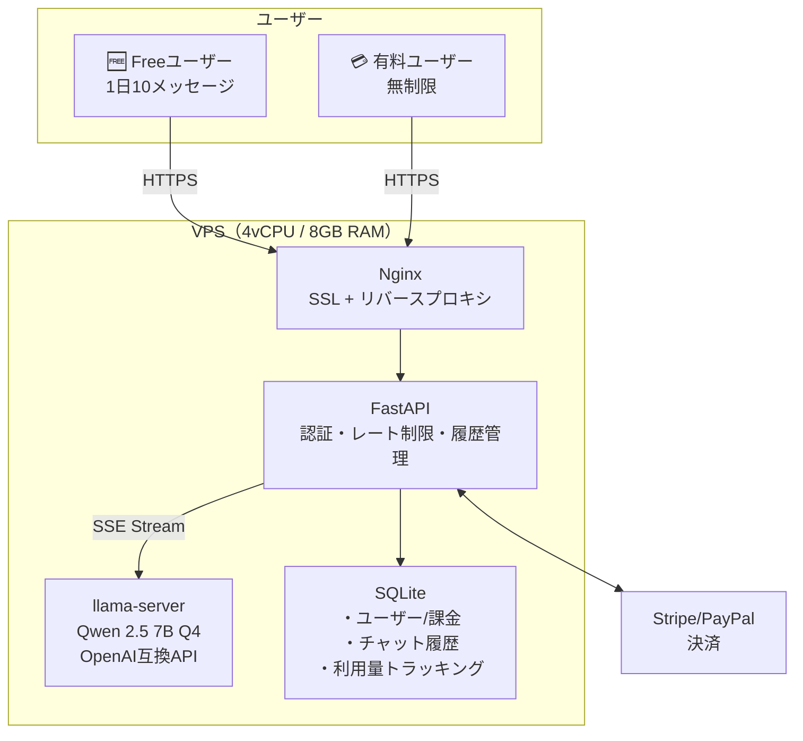

# LiteChat — 月¥500のAIチャットサービス 構想設計ドキュメント

> **コンセプト**: 「ChatGPT高い」層に月¥500でAI使い放題を提供  
> **技術基盤**: ローカルLLM（Qwen 2.5 7B）でAPI費用ゼロ運営  
> **一言で伝わる**: 「月500円でAI使い放題」

---

## 1. サービス概要

| 項目 | 内容 |
|------|------|
| **サービス名** | LiteChat |
| **概要** | ChatGPTライクなAIチャット。月¥500で利用制限なし |
| **ターゲット** | ChatGPT無料版では足りないが、月¥3,000は出したくない層 |
| **具体的なユーザー像** | 学生、副業初心者、ライトビジネスユーザー、コスト意識の高いフリーランス |
| **提供する価値** | ①安さ（¥500） ②制限なし ③データプライバシー（サーバー内完結） |
| **提供しないもの** | GPT-4o/Claude級の高精度回答、画像生成、ファイル分析。「ライト版」と明確に位置付け |

### 競合比較

| | LiteChat | ChatGPT Free | ChatGPT Plus | Claude Pro |
|--|---|---|---|---|
| **月額** | **¥500** | ¥0 | ¥3,000 | ¥2,900 |
| **利用制限** | **なし** | あり（GPT-4o制限大） | あり（GPT-4o制限） | あり |
| **精度** | 中（7Bモデル） | 中〜高 | 最高 | 最高 |
| **応答速度** | 3〜8秒 | 1〜3秒 | 1〜3秒 | 1〜3秒 |
| **データプライバシー** | **◎（サーバー内完結）** | △ | △ | △ |
| **日本語** | ○ | ◎ | ◎ | ◎ |

**ポジショニング: 「精度80%でいいから安く・制限なく使いたい」層**

---

## 2. 料金設計

| プラン | 月額 | 内容 |
|--------|------|------|
| **Free** | ¥0 | 1日10メッセージまで。登録不要のお試し |
| **Lite** | ¥500 | メッセージ無制限。チャット履歴7日保存 |
| **Plus** | ¥980 | メッセージ無制限。履歴30日保存。優先レスポンス |

### なぜこの価格か

- ¥500/月 = 1日約¥17。缶コーヒー以下
- ChatGPT Plus ¥3,000の**1/6**
- 損益分岐点: 14ユーザーで黒字（インフラ¥6,900/月）
- 「ワンコインでAI使い放題」はキャッチーで口コミが広がりやすい

---

## 3. 技術設計

### LLMモデル選定

**推奨: Qwen 2.5 7B Q4_K_M**

| 項目 | 値 |
|------|-----|
| パラメータ数 | 7B |
| 量子化後サイズ | ~4.5GB |
| ライセンス | Apache 2.0（商用完全OK） |
| 日本語品質 | 7Bクラスで最高 |
| CPU推論速度 | ~5 tokens/sec（4vCPU） |
| GPU推論速度 | ~30 tokens/sec（RTX 3060相当） |

**代替候補（軽量）:**
- Phi-3.5 Mini 3.8B Q4（2.5GB、高速だが日本語やや弱い）
- Gemma 2 9B Q4（5.5GB、高品質だがやや重い）

### 推論エンジン

**llama.cpp（llama-server）**
- C++実装で高速。CPU推論に最適化
- OpenAI互換APIを提供（フロントエンド開発が楽）
- ストリーミング応答（SSE）対応
- KVキャッシュによるメモリ効率化

### システム構成図



### チャット処理フロー

```
ユーザーがメッセージ送信
  ↓
[FastAPI] 認証チェック
  ↓
[FastAPI] レート制限チェック（Free: 10msg/日、Paid: 無制限）
  ↓
[FastAPI] チャット履歴取得（直近5往復 = コンテキスト）
  ↓
[llama-server] プロンプト構築 → 推論開始
  ↓
[SSE] トークン単位でリアルタイムストリーミング
  ↓
ユーザー画面にChatGPTのように1文字ずつ表示
  ↓
[DB] チャット履歴保存 + トークン数記録
```

### VPSリソース設計

```
Qwen 2.5 7B Q4_K_M メモリ使用:
  モデルロード: ~4.5GB
  KVキャッシュ（3セッション並列）: ~1.5GB
  FastAPI + Nginx + OS: ~1.0GB
  合計: ~7.0GB / 8GB RAM

→ 8GB RAMで稼働可能。余裕を持つなら16GBが理想
```

### 同時接続の限界と対策

| CPU推論（Phase 1） | GPU推論（Phase 2） |
|---|---|
| 同時2〜3リクエスト | 同時10〜20リクエスト |
| 応答: 3〜8秒/500トークン | 応答: 0.5〜2秒/500トークン |
| 上限: ~50ユーザー | 上限: ~300ユーザー |

**同時接続が上限を超えた場合:**
```
[キュー] 「順番待ちです（あと約10秒）」を表示
  → 待ち時間が30秒超 → 「現在混み合っています。しばらくしてからお試しください」
  → 有料Plusプラン → 優先キューで待ち時間を短縮
```

---

## 4. フロントエンド設計

### チャットUI要件

- ChatGPTライクなシンプルUIで直感的に使える
- ストリーミング表示（1文字ずつ表示、体感速度UP）
- レスポンシブ対応（スマホメイン想定）
- ダークモード対応
- チャット履歴一覧（サイドバー）
- 新規チャット作成

### ページ構成

| ページ | パス | 内容 |
|--------|------|------|
| LP | `/` | サービス紹介 + 料金 + 「今すぐ無料で試す」ボタン |
| チャット | `/chat` | メインのチャットUI |
| 料金 | `/pricing` | プラン比較 + 決済 |
| 特商法 | `/legal` | 特定商取引法に基づく表記 |
| プライバシー | `/privacy` | プライバシーポリシー |

---

## 5. 収支シミュレーション

### 固定費

```
VPS（4vCPU/8GB RAM）: ¥6,000（~$40/月）
ドメイン: ¥150/月
Claude API（将来の補正用予備）: ¥0（Phase 1では不使用）
合計: ¥6,150/月
```

### 収支予測（保守的）

```
              Month1    Month2    Month3    Month4    Month5    Month6
費用(¥)        ¥6,150   ¥6,150   ¥6,150   ¥6,150   ¥6,150   ¥6,150
──────────────────────────────────────────────────────────────
Free→Lite転換  10%       12%      15%      15%      15%      15%
──────────────────────────────────────────────────────────────
Freeユーザー   50人      100人    200人     300人    400人     500人
Liteユーザー   5人       12人     30人      50人     70人     100人
Plusユーザー   0人       2人      5人       10人     15人     25人
──────────────────────────────────────────────────────────────
Lite収益       ¥2,500   ¥6,000   ¥15,000  ¥25,000  ¥35,000  ¥50,000
Plus収益       ¥0       ¥1,960   ¥4,900   ¥9,800   ¥14,700  ¥24,500
収益計(¥)      ¥2,500   ¥7,960   ¥19,900  ¥34,800  ¥49,700  ¥74,500
損益(¥)       -¥3,650  +¥1,810  +¥13,750 +¥28,650 +¥43,550 +¥68,350
累計(¥)       -¥3,650  -¥1,840  +¥11,910 +¥40,560 +¥84,110 +¥152,460

※ Month 3で累計黒字化
※ 50ユーザー超でGPU移行検討（月+¥3,000〜¥9,000）
```

### 損益分岐点

```
Liteのみ:  ¥6,150 ÷ ¥500 = 13人で黒字
Lite+Plus: ¥6,150 ÷ ¥700（加重平均） = 9人で黒字
```

---

## 6. 集客戦略（営業ゼロ）

| チャネル | 施策 | コスト |
|---------|------|--------|
| **口コミ** | 「月500円AI使い放題」のインパクトで自然拡散 | ¥0 |
| **SEO** | 「ChatGPT 安い 代替」「AI チャット 500円」等のキーワードで記事作成 | ¥0 |
| **X (Twitter)** | サービス紹介 + 利用例を定期投稿。管理者承認後に投稿 | ¥0 |
| **Free枠からの転換** | 無料10メッセージ → 使い切ったら「¥500で無制限に」の自然導線 | ¥0 |
| **SiteScanからの送客** | SiteScanユーザーにLiteChatを案内 | ¥0 |

**核心: Free枠の「1日10メッセージ」を体験させて、足りなくなったら¥500に転換**

---

## 7. 開発ロードマップ

### Phase 1: MVP（2週間）

| 期間 | タスク |
|------|--------|
| **Week 1** | VPS(8GB)セットアップ + llama.cpp + Qwen 2.5 7Bデプロイ + FastAPI(認証・レート制限・履歴) |
| **Week 2** | チャットUI(Next.js) + SSEストリーミング + 決済連携 + LP + リリース |

### Phase 2: 改善（Month 2〜3）

- レスポンス速度最適化
- チャットUIの改善（ダークモード、モバイル最適化）
- Plusプランの差別化機能追加
- SEO記事の自動生成（SiteScanのSales Agentと共用）

### Phase 3: スケール（Month 4〜）

- ユーザー50人超でGPU VPSに移行
- モデル更新（Qwen 3等の新モデルへの差し替え）
- 将来拡張: テキスト分類API（TagEngine）の追加検討

---

## 8. リスクと対策

| リスク | 対策 |
|--------|------|
| **回答品質への不満** | 「ライト版」を明示。LP・料金ページで「日常利用向け。高精度が必要な方はChatGPT Plusを推奨します」と誠実に記載 |
| **同時接続の限界** | キュー制御 + Plusプランの優先キュー + Phase 2でGPU移行 |
| **ChatGPTが値下げ** | 「データプライバシー」と「制限なし」は価格に関係なく差別化要因。¥500はこれ以上下げる必要がない価格帯 |
| **LLMモデルの陳腐化** | OSS LLMは3ヶ月ごとに進化。モデル差し替えはllama.cppの設定変更だけで可能 |
| **不適切利用** | システムプロンプトでフィルタリング + 利用規約で禁止事項を定義 |
| **VPS障害** | 日次バックアップ（チャット履歴DB）+ 復旧手順書 |

---

## 9. 法的要件

| 要件 | 対応 |
|------|------|
| **特商法表記** | 新規ドメイン or pik-tal.comのサブパス。販売者情報・返品ポリシー |
| **プライバシーポリシー** | チャット内容の保存期間・利用目的を明記。「モデル学習には使用しない」を明記 |
| **AI免責** | 「AI生成の回答です。正確性を保証しません。重要な判断にはご自身で確認してください」 |
| **利用規約** | 禁止事項（違法行為の幇助、ハラスメント生成等）を定義 |
| **特定電気通信役務提供者の損害賠償責任の制限及び発信者情報の開示に関する法律** | チャットサービスとして該当する可能性。利用規約で対応 |

---

## 10. SiteScan/ToSWatch との統合

```
pik-tal.com（既存）
├── /          → SiteScan LP
├── /toswatch  → ToSWatch ダッシュボード
├── /legal     → 特商法表記（共通）
└── /privacy   → プライバシーポリシー（共通）

litechat.pik-tal.com（新規サブドメイン）or chat.pik-tal.com
├── /          → LiteChat LP
├── /chat      → チャットUI
└── /pricing   → 料金プラン

共通:
- 同一Stripeアカウントで決済
- フッターで相互リンク
- 同一管理者Discord通知
```

---

*Generated: 2026-04-09*
*Version: 2.0 — チャット特化版*
